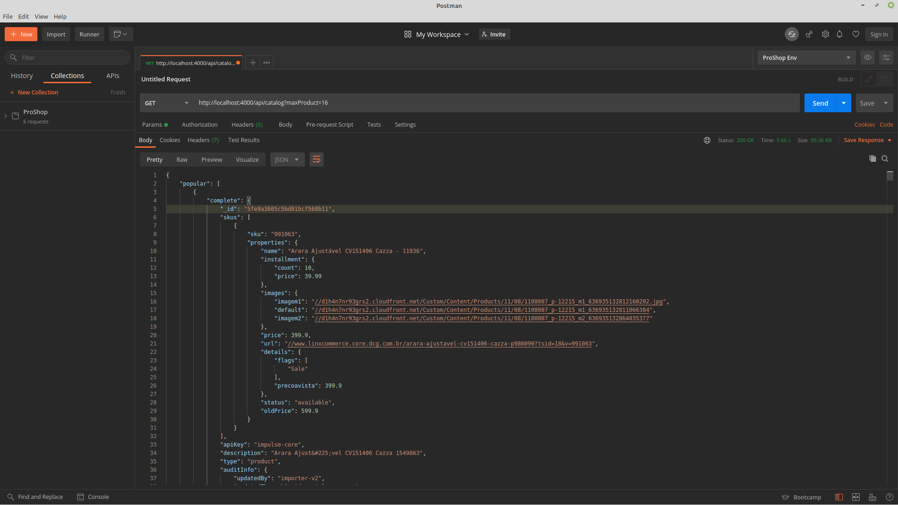

# Desafio-Tecnico-Linx-Impulse
Implementação de um sistema contendo mais de uma camada, duas de backend e uma de frontend. A aplicação a ser desenvolvida, é um sistema para exibir as vitrines de recomendação em um site, o sistema deverá conter 3 camadas.

### Screenshot do postman, retornando a resposta do http://localhost:4000/api/catalog?maxProduct=16

### GIF do carousel de Produtos Mais Vendidos - Incompleto

